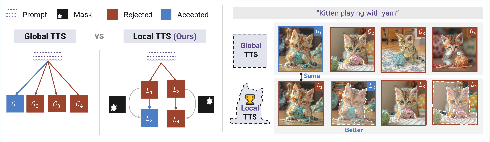
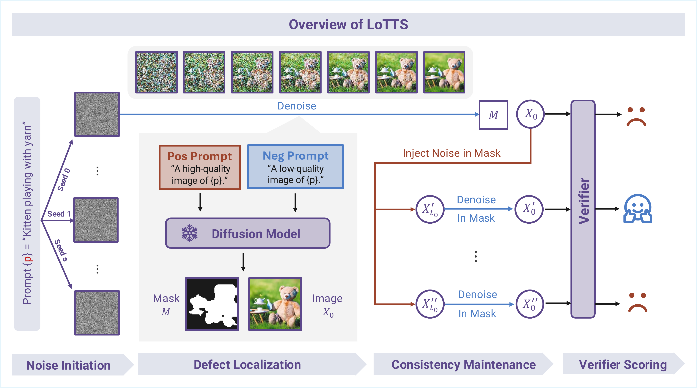

<div align="center">

<h1>Scale Where It Matters:<br/>Training-Free Localized Scaling for Diffusion Models</h1>

Qin Ren<sup>1</sup>, Yufei Wang<sup>2,6</sup>, Lanqing Guo<sup>3</sup>, Wen Zhang<sup>4</sup>, Zhiwen Fan<sup>5</sup>, Chenyu You<sup>1</sup>

<sup>1</sup>Stony Brook University &nbsp; <sup>2</sup>Nanyang Technological University &nbsp; <sup>3</sup>UT Austin<br/>
<sup>4</sup>Johns Hopkins University &nbsp; <sup>5</sup>Texas A&M University &nbsp; <sup>6</sup>SparcAI Research

[](https://arxiv.org/abs/2511.19917)
[](https://y-research-sbu.github.io/LoTTS/)
[](https://github.com/Y-Research-SBU/LoTTS)
[](https://github.com/Y-Research-SBU/LoTTS)

</div>

---


<div align="center">

<br>
<sub><b>Where should extra inference go?</b> Typical TTS perturbs or resamples the <i>whole</i> image, even when only a small region is wrong. <b>LoTTS</b> uses quality-aware attention to find those weak regions and runs test-time scaling <b>only there</b>, leaving high-quality pixels fixed—training-free, and a much smaller search space.</sub>
</div>

## Overview

Test-time scaling for diffusion models usually perturbs the *entire* image, yet quality is often uneven across the canvas.

> Defects are typically *localized*: **additional compute is better spent on weak regions than on restarting the whole sample.**

**LoTTS** is training-free: attention-derived masks for localization, masked resampling with consistency controls.

- **Localization.** Contrast cross-/self-attention under quality prompts; form a coherent defect mask.
- **Resampling.** Noise injection and denoising inside the mask; brief global harmonization.
- **Efficiency.** Plug-and-play across backbones; ~**2–4×** fewer samples than Best-of-*N* at matched budgets.

## Method

<div align="center">

<br>
<sub><b>Overview of LoTTS.</b> Given a text prompt, LoTTS first generates candidate images from different noise seeds. It then localizes defective regions using high-/low-quality prompt contrast and constructs a quality-aware mask. Noise is injected only inside the masked regions, followed by localized denoising with spatial and temporal consistency. A verifier finally selects the best refined sample.</sub>
</div>

<br>


## Acknowledgements

This project builds upon the following excellent open-source works:

- [Diffusers](https://github.com/huggingface/diffusers) — Hugging Face diffusion model library
- [ImageReward](https://github.com/THUDM/ImageReward) — Human preference reward model
- [HPSv2](https://github.com/tgxs002/HPSv2) — Human Preference Score v2
- [ConceptAttention](https://github.com/helblazer811/ConceptAttention) — Attention map extraction
- [attention-map-diffusers](https://github.com/wooyeolbaek/attention-map-diffusers) — Attention map utilities

## Citation

If you find this work useful, please consider citing:

```bibtex
@article{ren2025lotts,
  title   = {Scale Where It Matters: Training-Free Localized Scaling for Diffusion Models},
  author  = {Ren, Qin and Wang, Yufei and Guo, Lanqing and Zhang, Wen and Fan, Zhiwen and You, Chenyu},
  journal = {arXiv preprint arXiv:2511.19917},
  year    = {2025}
}
```

## License

This project is released under the [MIT License](LICENSE).
